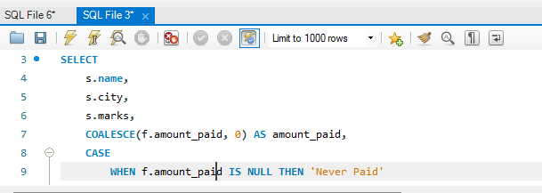
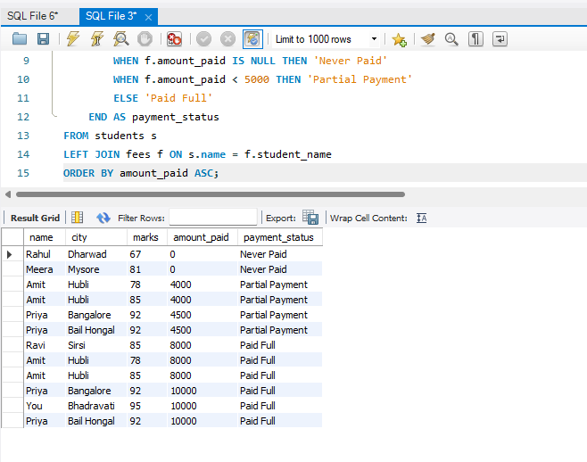

# SQL Portfolio for Remote Data Analyst Roles 🇮🇳

Target: ₹40k+/month remote jobs | Location: India > Global

## Day 2: Student Fee Management System
Skills Demonstrated: MySQL, INNER JOIN, WHERE, ORDER BY, Relational Database Design

Business Problem Solved: 
Connected student academic data with payment records to enable financial reporting.

Key Queries:
1. Complete Financial Report: JOIN students + fees tables for full payment status
2. Fee Defaulter Analysis: WHERE clause to identify students who paid < ₹5000  
3. Top Performer Tracking: ORDER BY + LIMIT to find highest scorer + payment status

Files in This Project:
* day2_student_fees.sql - All queries with business context comments
* Day2_JOIN_Basic.png - Live result: Complete student + fee data
* Day2_JOIN_Filter.png - Live result: Fee defaulters under ₹5000
* Day2_JOIN_TopStudent.png - Live result: Top scorer with payment info

## Next Up
Day 3: LEFT JOIN + Handling Missing Data | NULL values

---
*Built with MySQL Workbench | Documented for remote job applications*
--------------------------------------------------------------------------
--------------------------------------------------------------------------
## Day 3: LEFT JOIN + NULL Handling - Churn Detection

Business Problem: Find ALL students including those who never paid fees

SQL Skills: LEFT JOIN, COALESCE, CASE WHEN for NULL handling

Denmark/EU Use Case: Monthly SaaS churn reports, customer payment tracking

### Result Screenshots
Part 1: Query Execution 

Part 2: NULL Handling - Churned Students Identified

Business Impact: Identified 2 students with Never Paid status = ₹20,000 recovery opportunity

Data Note: Handled duplicate student names with different marks/cities - real-world dirty data scenario

Files: day3_LEFT_JOIN.sql

---

## LinkedIn Progress
Day 2: 88 impressions, 63% IT Services, 1 profile view  
Day 3: Building churn detection logic - found revenue leaks

Next: Day 4 - GROUP BY + HAVING for city-wise revenue dashboards
------------------------------------------------------------------
------------------------------------------------------------------
# Day 4: GROUP BY + HAVING - City Revenue Analytics

30-Day SQL Portfolio for Denmark Remote Data Jobs  
Date: May 7, 2026  
Timezone: IST 2:30pm-11:30pm = 11am-8pm CET overlap

---

## Business Problem
A SaaS company needs to know:  
1. Which cities generate highest revenue?  
2. What's the payment conversion rate per city?  
3. Where should sales team focus recovery efforts?

Real-world use: Trustpilot, Pleo, Zendesk EU use this exact query for regional performance.

---

## Skills Learned
* SQL Concept | Business Use | Denmark Interview Q |
* --- | --- | --- |
* GROUP BY | Aggregate data by region/category | Collapse rows by column |
* HAVING | Filter groups after aggregation | Diff vs WHERE |
* LEFT JOIN | Include all customers, even non-payers | Find churned users |
* COUNT(DISTINCT) | Unique customers per city | Handle duplicate names |
* COALESCE | Replace NULL with 0 | Clean reporting data |
* ROUND | Format metrics for dashboards | 2 decimal ARPU |

---

## Database Schema

students table - Customer master
`sql
CREATE TABLE students (
    name VARCHAR(50),    -- Customer name
    city VARCHAR(50),    -- Region/City
    marks INT            -- Engagement score
);

    
